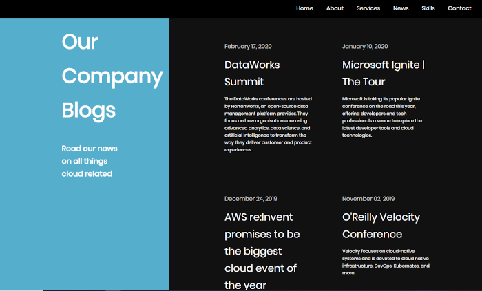

# Cloud_Web_Training_v3

Cloud Web Training is a website aimed at companies who are currently not yet utilising the cloud and would like help and advice on how to migrate to the cloud and also what the cloud has to offer for them, taking into account their business needs and what cloud platform will best suit them.

This is the 3rd version for this project and when creating this current version from scratch, it was a good opportunity for me to really clear out irrelevant CSS and add additional features i previously was unable to complete for example the sticky aspect for headers moving down the page when scrolling

I was also able to re-design the slider feature which i had on the previous project, previously i had achieved this feature using just CSS which took a lot of CSS elements and was quite messy to implement.
Here i was able to achieve the same result using JavaScript with a simple loop through the images.

Version 2 of this project was an update of the original version and the repository can be found "https://github.com/ShrewdStyle/cloud_web_training"

This project has been completed on a single HTML page and as a result i have been able to implement the smooth scroll effect, when clicking on the NAVbar at the top of the page, the feature will then automatically scroll to the selected section giving it a better UX for visitors.
